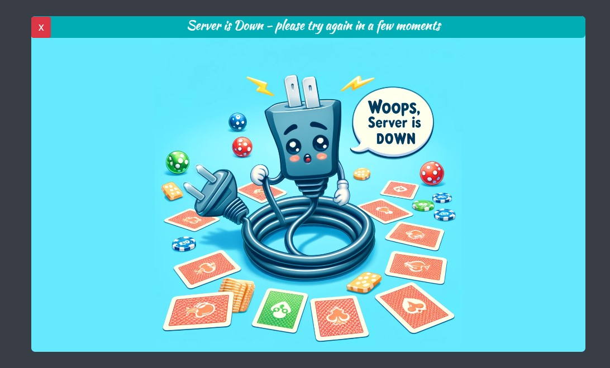

# Flip it!
### A memory card game with customizable cards

### hosted demo: https://flip-it-memory-game.vercel.app/


<p>Flip it is a client-server project made completely using Vanilla.js. The client is a pure SPA (single page application) that makes AJAX calls to the server to read, validate, and write scores onto the scoreboard. </p>
<p>In Flip-it you can choose between two kinds of decks, Marvel and South Park, or you can customize your own deck by dragging png or jpg images onto the "customize" panel.</p>
<p>You play against the clock. Your goal is to reveal all the cards in the shortest time possible. Revealing a mismatch will cost you a 2-second delay, whereas picking the correct pair allows you to continue instantly. You can always strive to beat your own records (stored in local storage), and if you're good enough, you might even qualify for the global scoreboard table and gain eternal glory by putting your name there!</p>

### Main features:

* Choose your desired deck of cards or customize your own.
* Local and global record-breaking system.
* Service-check and error handling - your game will continue smoothly even when the server is down (offline mode). When trying to present the scoreboard, a proper message will show up indicating the server is down.
* Score validation - every game has a unique game ID, signed end-to-end. Malicious users will find it hard to manipulate the system and enter the scoreboard by cheating.

> example of a 'server down' alert when trying to present the scoreboard

## Installation
<br>
First, run:

```cmd
npm install
```

Then start the server by running:
```cmd
npm start
```

Then go to `localhost:3000`.
<br><br>

> Note: If you're using VS Code you can use my `launch.json` file by running: `Run server and Open Memory Game 🟢` command.

## Configuration (env-variables)

* The server uses a Redis in-memory database (hosted by Upstash) to handle the scoreboard. Database credentials should be provided as follows; if not, the game will start in 'offline mode' and won't allow setting new records or presenting the scoreboard.

    * `UPSTASH_REDIS_REST_TOKEN` - credentials
    * `UPSTASH_REDIS_REST_URL` - credentials
    * `SCOREBOARD_REDIS_KEY` - Redis entry to store scoreboard results
    * `GAME_ID_ALLOCATION_REDIS_KEY` - Redis entry to save game IDs
    
* Additional configurations:
    * `VALIDATION_GRACE` - defaults to 3 seconds. Needed to validate user-submitted scores; the smaller the grace period, the stricter the validation.


# Enjoy!
